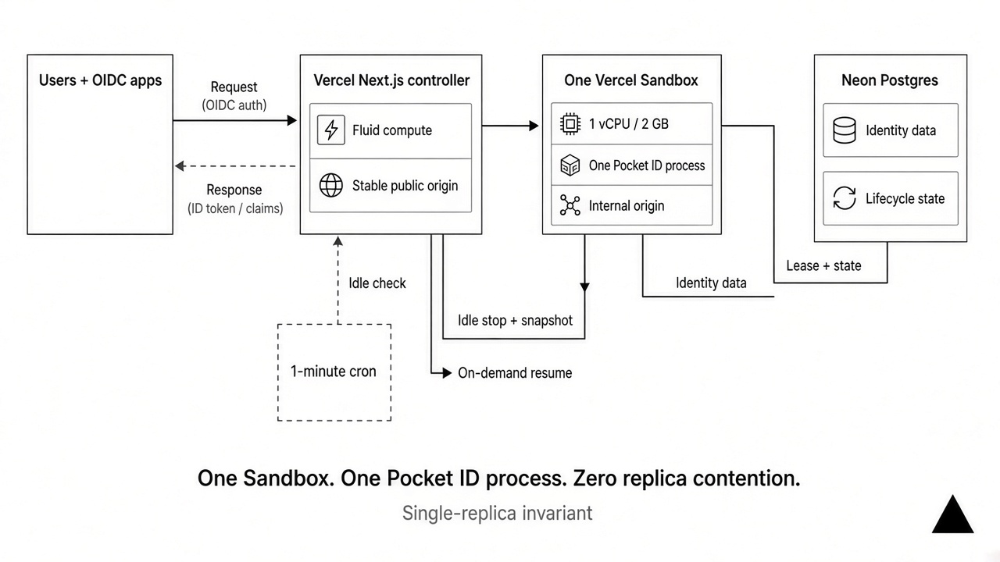

# Pocket ID on Vercel — a workshop identity provider you delete afterwards

Running a hands-on workshop loses its first 20–30 minutes to accounts: signups, verification codes, invite emails, "are you in the team yet?". This template gives every attendee an identity from a **passkey alone** — one QR code, no email, no password — and then goes away when the event does.

It runs upstream [Pocket ID](https://github.com/pocket-id/pocket-id) unmodified inside one Vercel Sandbox, fronted by a small Next.js controller. Deploy it, click **Prepare workshop**, put the QR code on a slide.

## Which mode do you need?

Pick this on the first-run screen. You can change it from the console until you click **Prepare workshop**.

| | **App mode** | **Vercel team mode** |
|---|---|---|
| Attendees sign in to… | An app the room is building | A Vercel Enterprise team (and v0) |
| What Pocket ID becomes | The OIDC login provider for that app | The identity provider behind the team's SSO + Directory Sync (Enterprise Managed Users) |
| What you get after Prepare | A public PKCE client `workshop-app` accepting any `https://*.vercel.app/...` callback | A confidential client `vercel-sso` with a secret, plus a SCIM push into the team |
| Attendee email | Optional (or required, your choice) | Assigned automatically as `username@<your verified domain>` |
| Vercel side | Nothing | An Enterprise team with a verified domain, SSO, Directory Sync, and Enterprise Managed Users enabled |

Use **App mode** for "add login to your Next.js app" style sessions, auth-library workshops, or any demo that needs a throwaway OIDC provider with wildcard redirect URIs.

Use **Vercel team mode** when attendees need Vercel accounts to deploy, use v0, or spend team credits, and you do not want them creating personal accounts.

## Deploy

[](https://vercel.com/new/clone?repository-url=https%3A%2F%2Fgithub.com%2FBrandon168%2Fpocket-id-vercel&project-name=idp-ws-DATE-TOPIC&repository-name=idp-ws-DATE-TOPIC&stores=%5B%7B%22type%22%3A%22integration%22%2C%22integrationSlug%22%3A%22neon%22%2C%22productSlug%22%3A%22neon%22%2C%22protocol%22%3A%22storage%22%7D%5D)

1. **Click Deploy.** Name the project, create the Neon store when asked, and uncheck the Neon Auth option (not used). Nothing else to fill in.
2. **The moment it says Ready, open `https://<project>.vercel.app`.** Use the short production domain, not the longer `<project>-xxxx-<team>.vercel.app` deployment URL. Every path redirects to a one-time `/setup` screen. Until someone completes it, the first visitor owns the workshop, so do this right away.
3. **On `/setup`, pick the mode, room size, and (Vercel team mode) the verified email domain, then click once.** It generates the workshop's secrets, shows you an instructor password one time, and immediately starts preparing the workshop in the background: Pocket ID boots (about a minute), then the instructor admin, groups, OIDC client, and signup capacity are created.
4. **Copy the password and open the console.** Your browser is already signed in as the instructor; the password is only for other devices, where the browser's sign-in prompt accepts it with an empty username.
5. **Put the QR code on your slide.** Attendees scan, choose a username, create a passkey, done.

Two clicks after the deploy finishes. The console can also change options and re-run Prepare if something interrupted it; every step is safe to repeat.

Pro or Enterprise is required for the deploying team: the idle cron runs every minute and Sandbox sessions exceed Hobby limits. The production domain must stay publicly reachable (see below).

### Or from your terminal

Same result, no GitHub clone, no prompts, about 40 seconds:

```bash
vercel login                                   # once
curl -fsSL https://raw.githubusercontent.com/Brandon168/pocket-id-vercel/main/deploy.sh \
  | bash -s -- --scope <team-slug> --project idp-ws-<date>-<topic>
```

It creates the project, installs Neon from the Marketplace, deploys, and opens `/setup` for you. `./deploy.sh --help` lists the options: `--idle-minutes`, `--database-url` to bring your own Postgres (for teams where the Neon Marketplace install is not allowed, such as children of a Vercel Organization), `--existing-project`, `--ref`. Tear down with `./teardown.sh <project> --scope <team> --yes`.

### Or let your agent do it

The repo ships an [agent skill](skills/pocket-id-workshop/SKILL.md) that knows the deploy script, the first-run choices, the Vercel team connection steps, the console's API for running the day, and the teardown:

```bash
npx skills add Brandon168/pocket-id-vercel@pocket-id-workshop -g -y
```

Then ask your agent to "set up a passkey identity provider for Thursday's workshop" and answer its three questions.

### Why the production domain matters

The controller uses `https://<project>.vercel.app` as Pocket ID's `APP_URL`, OIDC issuer, and WebAuthn relying-party ID. Passkeys registered on any other hostname will not work, and neither will a custom domain added later. Standard Deployment Protection leaves this domain public while protecting deployment URLs, which is what you want; do not switch protection to "All Deployments", and do not deploy to a team that enforces authentication on production domains. Attendees have no account to authenticate with yet — that is the whole point — and in Vercel team mode Vercel's SSO service must reach the discovery document and token endpoint server-to-server.

## Vercel team mode: connecting the team

After **Prepare workshop**, the console shows a **Vercel team** panel with three numbered steps. Everything you need to paste is there, with copy buttons.

**On the Vercel team** (you must be an Owner): Settings → Security & Privacy → Authentication and User Provisioning.

1. **SAML → Configure → Custom OIDC.** Provider name `Pocket ID`. Vercel shows a login redirect URL of the form `https://auth.vercel.com/sso/oidc/<id>/callback`; Pocket ID already accepts it through a wildcard, so nothing to paste back (you can pin the exact URL from the console if you prefer). Paste the **Discovery endpoint**, **Client ID**, and **Client secret** from the console into the dialog.
2. **Directory Sync → Configure → Custom SCIM.** Directory provider `Pocket ID`, authentication by bearer token. Vercel shows a SCIM endpoint (`https://auth.vercel.com/scim/v2.0/<id>`) and a token; paste both into step 2 of the console and click **Connect and push now**. Once the first push lands, Vercel lets you save the directory. From then on every signup reaches Vercel within about a minute (Pocket ID pushes ~15 s after the signup, Vercel takes up to a minute to apply it), Pocket ID re-syncs hourly, and **Sync now** is there for after you fix an attendee by hand.
3. **Map groups and enable EMU.** Map the `workshop` group to **Member** (or an Access Group). Attendees are also placed in `vercel-role-member`, which Vercel treats as the Member role even with no mapping, so nobody lands as a viewer. Keep yourself an Owner before confirming the first sync, then enable Enterprise Managed Users.

Set the **team slug** in the console: Pocket ID then shows attendees a **Vercel** tile that opens `https://vercel.com/login?saml=<slug>`, and the console shows the same link for your slide.

The email domain you entered at `/setup` must be verified on the team. Every attendee is registered as `username@<that domain>` regardless of what they type in the email field, so attendees cannot use the wrong domain and no email is ever sent.

**Attendee flow:** scan the QR → username + passkey → within about a minute they can sign in at `vercel.com/login?saml=<slug>`. They are in the team, and in v0 if the team has it.

## App mode: pointing your app at Pocket ID

After **Prepare workshop**, the console shows the issuer, discovery URL, and client details:

| Setting | Value |
|---|---|
| Issuer / discovery | `https://<project>.vercel.app` / `…/.well-known/openid-configuration` |
| Client ID | `workshop-app` |
| Client type | Public, PKCE required, no secret |
| Callback | `https://*.vercel.app/api/auth/callback/pocket-id` |

The wildcard means every attendee's preview and production deployments can complete sign-in without registering URLs. Edit the client in Pocket ID admin (**OIDC Clients**) if your app uses a different callback path or needs a confidential client.

## What `/setup` generates

| Secret | Purpose | Visibility |
|---|---|---|
| Encryption key | Protects Pocket ID's stored private keys | Never shown |
| Pocket ID API key | Server-side provisioning from the console | Behind a disclosure on `/setup`; only needed for `setup.sh` |
| Instructor password | Console access from other devices (Basic auth); stored as a hash. The deploying browser gets a session cookie instead. | Shown once on `/setup` |
| `vercel-sso` client secret (team mode) | Pasted into Vercel's SSO dialog | Shown in the console behind **Show**; rotate from there |

All of these live in the workshop's Neon database next to the data they protect. For a workshop that exists for a few days and is then deleted, that is the intended trade for a zero-input deploy. The `/setup` claim is atomic, so exactly one visitor can complete it; afterwards `/setup` redirects to `/workshop` permanently. If `/setup` says someone else already completed it, delete the project and the Neon resource and deploy again.

Lost the password? Set `WORKSHOP_ADMIN_SECRET` on the Vercel project and redeploy. Environment variables override the generated values.

## Attendee signup

Pocket ID always requires a username and treats first and last name as optional. Because the username is the only guaranteed identifier, tell attendees on the signup slide to use `firstname-lastname`; that is how you will find them in the console if they need help, and in Vercel team mode it becomes their email's local part. After registering a passkey, attendees land on Pocket ID's `/settings/account` page (hard-coded in Pocket ID's frontend).

Signup capacity is `expected attendees × 1.2`, rounded up to whole 100-use signup tokens (Pocket ID's per-token cap). `/join` rotates attendees across them. Tokens expire after 72 hours. The console shows live signup counts while Pocket ID is running.

### Attendees who cannot use a passkey

Passkeys need no app: Touch ID, Face ID, Windows Hello, or Android screen lock all work, and the browser offers a QR code so a personal phone can hold the passkey for a locked-down laptop. For the few who are blocked entirely:

- **Skip for now** at the passkey step. Signup already signed them in, and the controller sets Pocket ID sessions to 30 days, so they stay signed in for the whole event on that device.
- **Signed out or on another device:** the *Attendees* table in `/workshop` lists everyone who has registered, newest first, with a Passkey column so you can spot who skipped it. **Login code** on their row mints a 12-character one-time code (valid one hour). Send them the link, or have them type the code at `<project>.vercel.app/lc`. No email is involved.

For most workshops this means never opening the Pocket ID admin UI. It remains one click away: **Open Pocket ID admin in a new tab** signs you in as `instructor` with a fresh one-time code. Add a passkey under Settings → Account once you are there so you can sign in normally afterwards.

## Teardown

Delete both the Vercel project (which removes the Sandbox and snapshots) and the Neon Marketplace resource (which holds attendee identities and controller state). Marketplace resources survive project deletion; `teardown.sh` removes both. In Vercel team mode, also remove the SSO and Directory Sync configuration from the team, or its managed users will remain.

## How it works



Pocket ID embeds a single-host actor system, so exactly one process may run per database. The controller enforces that:

- **One Sandbox, one process.** A named persistent Sandbox runs Pocket ID v2.14.0 (downloaded and SHA-256-verified on first boot). The controller proxies every request to it and rewrites redirects back to the stable hostname. In Vercel team mode the proxy also rewrites the email on `POST /api/signup` to the verified domain.
- **Neon-backed lease.** Concurrent cold requests elect one starter through an expiring lease; the rest wait for the same origin. Fluid compute can run many controller invocations without starting a second Pocket ID.
- **Scale to zero.** A one-minute cron stops and snapshots the Sandbox after `SANDBOX_IDLE_MINUTES` (default 120) without traffic. The next request resumes it inside the same HTTP call. Graceful stop clears the stale actor-host row so restart is never blocked.
- **Shared database.** One Neon project holds Pocket ID's tables and the controller's lifecycle, workshop, secrets, and Vercel-connection tables. Set `CONTROLLER_DATABASE_URL` to split them.

> The controller and lifecycle were load-tested in an earlier iteration. The Deploy Button path with first-run setup and Vercel team mode are newer; run your chosen mode end to end before relying on it for an event.

## Environment variables

None are required. The Neon store injects `DATABASE_URL` and `DATABASE_URL_UNPOOLED`. Optional overrides:

| Variable | Notes |
|---|---|
| `ENCRYPTION_KEY`, `STATIC_API_KEY`, `WORKSHOP_ADMIN_SECRET` | Override generated secrets. Setting all three skips `/setup` entirely. |
| `APP_URL` | Exact public origin, if not the production `.vercel.app` domain. |
| `SANDBOX_IDLE_MINUTES` | Default 120. |
| `SANDBOX_NAME`, `SANDBOX_IMAGE`, `SANDBOX_STARTUP_TIMEOUT_MS` | Sandbox tuning. |
| `WORKSHOP_SETUP_DELAY_MS` | Gap between provisioning calls. Default 1000. |
| `CONTROLLER_DATABASE_URL` | Separate database for controller tables. |
| `LIFECYCLE_ADMIN_SECRET` | Enables manual `POST /api/lifecycle/stop`. |
| `CRON_SECRET` | Vercel supplies this to cron calls. |

## Operations

```bash
curl https://<project>.vercel.app/api/lifecycle/status          # inspect without waking the Sandbox
curl -X POST https://<project>.vercel.app/api/lifecycle/stop \
  -H "Authorization: Bearer $LIFECYCLE_ADMIN_SECRET"             # manual graceful stop
```

A stopped Sandbox costs only snapshot storage. `setup.sh` remains for custom headcounts, durations, or client settings and needs the API key from `/setup`.

## Files

- `proxy.ts` — first-run gate and instructor guard (session cookie or Basic auth) for `/workshop`.
- `app/setup`, `app/api/setup` — one-time secret generation and workshop options.
- `app/workshop`, `app/api/workshop` — instructor console, options editor, QR, admin handoff, Vercel connection.
- `app/join/route.ts` — stable attendee URL rotated across signup tokens.
- `app/[[...path]]/route.ts` — reverse proxy to the Sandbox, with the signup email policy and automatic Directory Sync push.
- `app/api/lifecycle/*` — cron, status, manual stop.
- `lib/secrets.ts` — Neon-backed secrets with atomic single-winner claim and env overrides.
- `lib/workshop{,-store,-auth}.ts` — provisioning, Vercel SSO/SCIM connection, persistence, instructor access.
- `lib/sandbox-control.ts`, `lib/lifecycle-store.ts` — Sandbox state machine and lease.
- `deploy.sh`, `teardown.sh` — terminal equivalents of the Deploy Button and of deleting the project plus its Neon resource.
- `skills/pocket-id-workshop/SKILL.md` — agent skill covering deploy, setup, team connection, day-of operations, teardown.
- `image/Dockerfile`, `setup.sh`, `sandbox-up.mjs`, `sandbox-down.mjs` — optional legacy tooling.
