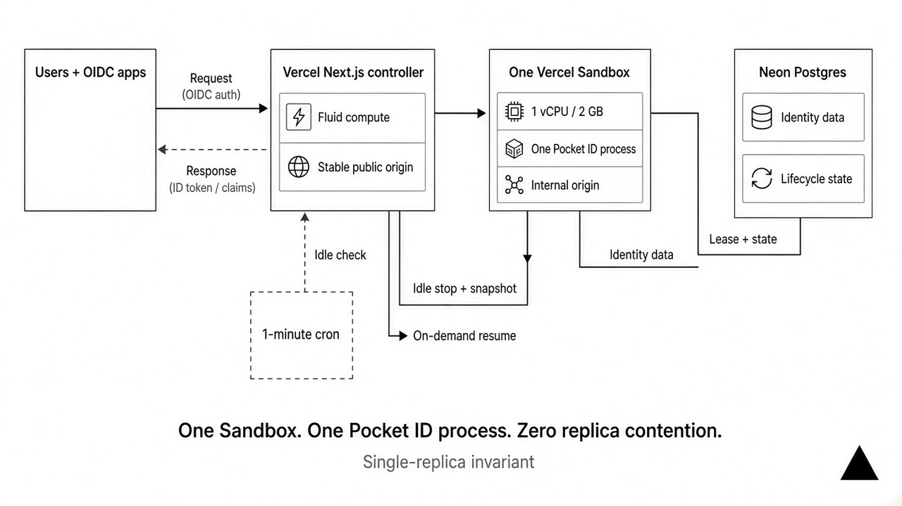

# Pocket ID on Vercel — a workshop identity provider you delete afterwards

Running a hands-on workshop loses its first 20–30 minutes to accounts: signups, verification codes, invite emails, "are you in the team yet?". This template gives every attendee an identity from a **passkey alone** — one signup link, no password — and then goes away when the event does.

It runs upstream [Pocket ID](https://github.com/pocket-id/pocket-id) unmodified inside one Vercel Sandbox, fronted by a small Next.js controller. Deploy it, prepare the workshop, and put the short `/join` link on a slide. Attendees open it on their workshop laptop; a QR code is optional.

## Which mode do you need?

Pick this on the first-run screen. You can change it from the console until you click **Prepare workshop**.

| Mode | Attendees sign in to | Prepared client | Vercel requirements |
|---|---|---|---|
| **Passport** | Deployed workshop apps | Confidential `workshop-passport`, callback `https://connect.vercel.com/callback` | Enterprise team Owner connects Passport and assigns projects |
| **App / direct OIDC** | An app with its own auth integration | Public PKCE `workshop-app`, callback `https://*.vercel.app/api/auth/callback/pocket-id` | App implements OIDC; adjust callback if needed |
| **Vercel team** | A Vercel Enterprise team (and v0) | Confidential `vercel-sso`, then SCIM connection | Verified domain, enforced SSO, Directory Sync and Enterprise Managed Users |

Use **Passport mode** to protect workshop apps with Pocket ID, including published v0 apps. It does not create Vercel or v0 accounts. Real IdP sign-in in the v0 editor sandbox remains unverified; a development identity fixture is not proof of it.

Use **App mode** for "add login to your Next.js app" style sessions, auth-library workshops, or any demo that needs a throwaway OIDC provider with wildcard redirect URIs.

Use **Vercel team mode** when attendees need Vercel accounts to deploy, use v0, or spend team credits, and you do not want them creating personal accounts.

## Deploy

[](https://vercel.com/new/clone?repository-url=https%3A%2F%2Fgithub.com%2FBrandon168%2Fpocket-id-vercel&project-name=idp-ws-DATE-TOPIC&repository-name=idp-ws-DATE-TOPIC&stores=%5B%7B%22type%22%3A%22integration%22%2C%22integrationSlug%22%3A%22neon%22%2C%22productSlug%22%3A%22neon%22%2C%22protocol%22%3A%22storage%22%7D%5D)

1. **Click Deploy.** Name the project, create the Neon store when asked, and uncheck the Neon Auth option (not used). Nothing else to fill in.
2. **The moment it says Ready, open `https://<project>.vercel.app`.** Use the short production domain, not the longer `<project>-xxxx-<team>.vercel.app` deployment URL. Every path redirects to a one-time `/setup` screen. Until someone completes it, the first visitor owns the workshop, so do this right away.
3. **On `/setup`, pick the mode, room size, and (Vercel team mode) the verified email domain, then click once.** It generates the workshop's secrets, shows you an instructor password one time, and immediately starts preparing the workshop in the background: Pocket ID boots (about a minute), then the instructor admin, groups, OIDC client, and signup capacity are created.
4. **Copy the password and open the console.** Your browser is already signed in as the instructor; the password is only for other devices, where the browser's sign-in prompt accepts it with an empty username.
5. **Finish the mode's connection steps in the instructor console at `/workshop`.** Then put the short signup link on your slide. Attendees open it on their laptop, choose a username, and create a passkey. Show the optional QR code if useful.

Two clicks after the deploy finishes. The console can also change options and re-run Prepare if something interrupted it; every step is safe to repeat.

Pro or Enterprise is required for the deploying team: the idle cron runs every minute and Sandbox sessions exceed Hobby limits. The production domain must stay publicly reachable (see below).

### Or from your terminal

Same result, no GitHub clone, no prompts, about 40 seconds:

```bash
vercel login                                   # once
curl -fsSL https://raw.githubusercontent.com/Brandon168/pocket-id-vercel/main/deploy.sh \
  | bash -s -- --scope <team-slug> --project idp-ws-<date>-<topic>
```

It creates the project, installs Neon from the Marketplace, deploys, and opens `/setup` for you. `./deploy.sh --help` lists the options: `--idle-minutes`, `--database-url` to bring your own Postgres (for teams where the Neon Marketplace install is not allowed, such as children of a Vercel Organization), `--existing-project`, `--ref`. Tear down with `./teardown.sh <project> --scope <team> --yes`.

### Or let your agent do it

The repo ships an [agent skill](skills/pocket-id-workshop/SKILL.md) that knows the deploy script, the first-run choices, the Vercel team connection steps, the console's API for running the day, and the teardown:

```bash
npx skills add Brandon168/pocket-id-vercel@pocket-id-workshop -g -y
```

Then ask your agent to "set up a passkey identity provider for Thursday's workshop" and answer its three questions.

### Why the production domain matters

The controller uses `https://<project>.vercel.app` as Pocket ID's `APP_URL`, OIDC issuer, and WebAuthn relying-party ID. Passkeys registered on any other hostname will not work, and neither will a custom domain added later. Standard Deployment Protection leaves this domain public while protecting deployment URLs, which is what you want; do not switch protection to "All Deployments", and do not deploy to a team that enforces authentication on production domains. Attendees have no account to authenticate with yet — that is the whole point — and in Vercel team mode Vercel's SSO service must reach the discovery document and token endpoint server-to-server.

## Vercel team mode: connecting the team

After **Prepare workshop**, the console shows a **Vercel team** panel with four numbered steps. Everything you need to paste is there, with copy buttons. For the Pocket ID-specific setup guide, selected rehearsal screenshots, validation limits, and troubleshooting, see [docs/vercel-team-setup.md](docs/vercel-team-setup.md).

**On the Vercel team** (you must be an Owner): Settings → Security & Privacy → Authentication and User Provisioning. Vercel enforces this order; the console's Vercel team panel shows the same four steps with copy buttons.

1. **SAML → Configure → Custom OIDC, then enforce.** Provider name `Pocket ID`. Vercel shows a login redirect URL of the form `https://auth.vercel.com/sso/oidc/<id>/callback`; Pocket ID already accepts it through a wildcard, so nothing to paste back. Paste the **Discovery endpoint**, **Client ID**, and **Client secret** from the console; leave the advanced settings at their defaults. For the portal's sign-in test, and again for **Re-Authenticate** on the Security page, sign in through Pocket ID as `instructor` (use *Open Pocket ID admin* first). Then turn on **Require team members to log in with SAML**. Enforcing invalidates every personal Vercel token for the team, so finish CLI work first.
2. **Directory Sync → Configure → Custom SCIM, without mapping roles.** Directory provider `Pocket ID`, authentication by bearer token. Vercel shows a SCIM endpoint (`https://auth.vercel.com/scim/v2.0/<id>`) and a token; paste both into step 2 of the console and click **Connect and push now**. Once the first push lands, Vercel lets you finish. When it offers role mapping, choose **Set Up Enterprise Managed Users First**: mapping before EMU creates ordinary invitations that stop working once EMU is on.
3. **Enable Enterprise Managed Users and verify the domain.** Turn on the EMU toggle; in Manage Domains click *Configure Domain* (it navigates away, so open it in a new tab), enter the domain you chose at `/setup`, and add the TXT record Vercel shows at your DNS provider. Verification is automatic within about a minute. Toggle EMU again, select the domain, and in **Select Teams** confirm only this team (the sheet lists every eligible team you own).
4. **Map groups to roles.** `vercel-role-member` and `vercel-role-owner` arrive pre-mapped and locked to Member and Owner; map `workshop` to **Member** or an Access Group. Your `instructor` identity is in `vercel-role-owner` (email `instructor@<domain>` by default, or your own Vercel login email; change it in the console), so the first sync cannot lock you out. From then on every signup reaches Vercel within about a minute and attendees sign in at `vercel.com/login?saml=<slug>` with no account creation.

Set the **team slug** in the console: Pocket ID then shows attendees a **Vercel** tile that opens `https://vercel.com/login?saml=<slug>`, and the console shows the same link for your slide.

**Choosing the domain.** EMU needs a domain you control, verified on the team with a TXT record. You can buy one through Vercel or use an existing domain (`vercel domains ls --scope <team>` lists them). A dedicated event subdomain such as `workshop.yourcompany.com` makes cleanup easier. No website or mailbox is needed; `*.vercel.app` cannot be verified. The domain entered at `/setup` must match the verified domain. Attendee addresses use that domain and nothing is emailed.

**Attendee flow:** open `/join` on a laptop → username + passkey → allow Directory Sync to finish → sign in at `vercel.com/login?saml=<slug>`. Verify team membership and v0 access in a dry run before the event.

## Passport mode: protecting deployed apps

The **instructor console** is this template's `/workshop` page. Its Passport panel shows a separate confidential client and a stored secret. The **Pocket ID admin** UI manages upstream users and clients; it is not the instructor console.

1. Prepare a Passport workshop. The client accepts only `https://connect.vercel.com/callback` and is restricted to the workshop group.
2. As a Vercel Enterprise team Owner, open Passport settings and create an **OAuth Connect application → Your own credentials**. Paste the issuer into **Server URL**, select **Discover**, and enter the console's client ID and secret. Request `openid`; add `profile` and `email` if needed.
3. Enable Passport for each app project and select this Connect application. A team default covers **new** projects; existing projects need assignment. Keep the Pocket ID issuer project publicly reachable, outside the Passport protection it supplies.
4. Register a throwaway attendee using `/join`, create a passkey, then visit a protected app in a separate browser session. Confirm sign-in and the verified identity received by the app. Published v0 deployments and the v0 editor sandbox are different environments; test real sign-in separately.

Preparation creates the Pocket ID credentials only. It does not configure Vercel or verify that Passport is working. See [Passport setup](https://vercel.com/docs/passport/set-up-identity-provider) and [reading identity](https://vercel.com/docs/passport/read-identity).

## App mode: pointing your app at Pocket ID

After **Prepare workshop**, the console shows the issuer, discovery URL, and client details:

| Setting | Value |
|---|---|
| Issuer / discovery | `https://<project>.vercel.app` / `…/.well-known/openid-configuration` |
| Client ID | `workshop-app` |
| Client type | Public, PKCE required, no secret |
| Callback | `https://*.vercel.app/api/auth/callback/pocket-id` |

The wildcard covers preview and production deployments using that exact callback path. It does not cover the v0 editor sandbox. Edit the client in Pocket ID admin (**OIDC Clients**) if your app uses a different callback path or needs a confidential client.

## What `/setup` generates

| Secret | Purpose | Visibility |
|---|---|---|
| Encryption key | Protects Pocket ID's stored private keys | Never shown |
| Pocket ID API key | Server-side provisioning from the console | Behind a disclosure on `/setup`; only needed for `setup.sh` |
| Instructor password | Console access from other devices (Basic auth); stored as a hash. The deploying browser gets a session cookie instead. | Shown once on `/setup` |
| `vercel-sso` client secret (team mode) | Pasted into Vercel's SSO dialog | Shown in the console behind **Show**; rotate from there |
| `workshop-passport` client secret (Passport mode) | Pasted into the Vercel Connect application | Available only through the instructor-authenticated console/API; hidden behind **Show** |

All of these live in the workshop's Neon database next to the data they protect. For a workshop that exists for a few days and is then deleted, that is the intended trade for a zero-input deploy. The `/setup` claim is atomic, so exactly one visitor can complete it; afterwards `/setup` redirects to `/workshop` permanently. If `/setup` says someone else already completed it, delete the project and the Neon resource and deploy again.

Lost the password? Set `WORKSHOP_ADMIN_SECRET` on the Vercel project and redeploy. Environment variables override the generated values.

## Attendee signup

Pocket ID always requires a username and treats first and last name as optional. Because the username is the only guaranteed identifier, tell attendees on the signup slide to use `firstname-lastname`; that is how you will find them in the console if they need help, and in Vercel team mode it becomes their email's local part. After registering a passkey, attendees land on Pocket ID's `/settings/account` page (hard-coded in Pocket ID's frontend).

Signup capacity is `expected attendees × 1.2`, rounded up to whole 100-use signup tokens (Pocket ID's per-token cap). `/join` rotates attendees across them. Tokens expire after 72 hours. The console shows live signup counts while Pocket ID is running.

This prepares signup tokens, not attendee accounts or Vercel billing seats. Choosing 100 attendees creates 2 tokens (capacity 200); choosing 1,000 creates 12 (capacity 1,200). The extra ten API calls each have a default one-second pause, adding roughly ten seconds plus request time. Accounts are created at signup. Flex does not need preset seat quantities, but team plan, entitlement and commitment checks remain separate; do not assume every Enterprise trial uses Flex.

### Attendees who cannot use a passkey

Passkeys need no app: Touch ID, Face ID, Windows Hello, or Android screen lock all work, and the browser offers a QR code so a personal phone can hold the passkey for a locked-down laptop. For the few who are blocked entirely:

- **Skip for now** at the passkey step. Signup already signed them in, and the controller sets Pocket ID sessions to 30 days, so they stay signed in for the whole event on that device.
- **Signed out or on another device:** the *Attendees* table in `/workshop` lists everyone who has registered, newest first, with a Passkey column so you can spot who skipped it. **Login code** on their row mints a 12-character one-time code (valid one hour). Send them the link, or have them type the code at `<project>.vercel.app/lc`. No email is involved.

For most workshops this means never opening the Pocket ID admin UI. It remains one click away: **Open Pocket ID admin in a new tab** signs you in as `instructor` with a fresh one-time code. Add a passkey under Settings → Account once you are there so you can sign in normally afterwards.

## Teardown

While Pocket ID still works, remove the workshop's Passport assignments and any team default, or disable team SSO enforcement and remove Directory Sync/SSO as applicable. Retire managed accounts and the participant team through the approved process. Then delete the IdP project and Neon resource with `teardown.sh`. Marketplace resources survive project deletion; deleting the IdP first can strand protected apps or an enforced team.

## How it works



Pocket ID embeds a single-host actor system, so exactly one process may run per database. The controller enforces that:

- **One Sandbox, one process.** A named persistent Sandbox runs Pocket ID v2.16.0 (downloaded and SHA-256-verified when the Sandbox is first created; its snapshot keeps that binary, so a redeploy never changes the Pocket ID version under a running workshop). The controller proxies every request to it and rewrites redirects back to the stable hostname. In Vercel team mode the proxy also rewrites the email on `POST /api/signup` to the verified domain, and Pocket ID's self-service account editing is turned off so an attendee cannot change that email afterwards (Vercel links SSO identities by verified email). Instructors can still edit any account in Pocket ID admin.
- **Neon-backed lease.** Concurrent cold requests elect one starter through an expiring lease; the rest wait for the same origin. Fluid compute can run many controller invocations without starting a second Pocket ID.
- **Scale to zero.** A one-minute cron stops and snapshots the Sandbox after `SANDBOX_IDLE_MINUTES` (default 120) without traffic. The next request resumes it inside the same HTTP call. Graceful stop clears the stale actor-host row so restart is never blocked.
- **Shared database.** One Neon project holds Pocket ID's tables and the controller's lifecycle, workshop, secrets, and Vercel-connection tables. Set `CONTROLLER_DATABASE_URL` to split them.

> The September 5 rehearsal verified SSO, SCIM, domain/EMU configuration and mappings, but did not establish a successful attendee team join: the rehearsal team rejected that step. Passport preparation is separate from a real Vercel connection. Run your chosen mode end to end on the intended team and deployment before an event.

## Environment variables

None are required. The Neon store injects `DATABASE_URL` and `DATABASE_URL_UNPOOLED`. Optional overrides:

| Variable | Notes |
|---|---|
| `ENCRYPTION_KEY`, `STATIC_API_KEY`, `WORKSHOP_ADMIN_SECRET` | Override generated secrets. Setting all three skips `/setup` entirely. |
| `APP_URL` | Exact public origin, if not the production `.vercel.app` domain. |
| `SANDBOX_IDLE_MINUTES` | Default 120. |
| `SANDBOX_NAME`, `SANDBOX_IMAGE`, `SANDBOX_STARTUP_TIMEOUT_MS` | Sandbox tuning. |
| `WORKSHOP_SETUP_DELAY_MS` | Gap between provisioning calls. Default 1000. |
| `CONTROLLER_DATABASE_URL` | Separate database for controller tables. |
| `LIFECYCLE_ADMIN_SECRET` | Enables manual `POST /api/lifecycle/stop`. |
| `CRON_SECRET` | Vercel supplies this to cron calls. |

## Operations

```bash
curl https://<project>.vercel.app/api/lifecycle/status          # inspect without waking the Sandbox
curl -u :$INSTRUCTOR_PASSWORD https://<project>.vercel.app/api/lifecycle/status  # adds lastError, lease, Sandbox origin
curl -X POST https://<project>.vercel.app/api/lifecycle/stop \
  -H "Authorization: Bearer $LIFECYCLE_ADMIN_SECRET"             # manual graceful stop
```

A stopped Sandbox costs only snapshot storage. `setup.sh` remains for custom headcounts, durations, or client settings and needs the API key from `/setup`.

## Local verification

`npm test` exercises all three provisioning modes, database persistence in disposable PGlite, retry behavior and instructor-only credential access. It does not use `.env.local` or call Vercel.

For an actual Pocket ID API and OIDC check, download the platform binary for **v2.16.0** (the version `lib/sandbox-control.ts` pins), verify its release checksum, and run `POCKET_ID_TEST_BINARY=/absolute/path/to/pocket-id npm test`. This starts the binary on localhost ports 14119/14120 with fresh SQLite data and removes that data afterwards. It verifies signup, group restrictions, client-secret authentication and the signature/claims of a real OIDC token. It does not test a passkey ceremony, Vercel Passport or the v0 editor.

Run `npm run typecheck` and `npm run build`. Then install the test browser with `npx playwright install chromium` and run `npm run test:browser`. Browser tests use the built Next.js app on port 3098 with dummy credentials, an unreachable database and intercepted workshop API responses. They check mode selection, error/retry, secret visibility/copy, and link-first signup on desktop/mobile. Set `PLAYWRIGHT_CHROMIUM_EXECUTABLE` to use an existing Chromium binary.

## Files

- `proxy.ts` — first-run gate and instructor guard (session cookie or Basic auth) for `/workshop`.
- `app/setup`, `app/api/setup` — one-time secret generation and workshop options.
- `app/workshop`, `app/api/workshop` — instructor console, options editor, QR, admin handoff, Vercel connection.
- `app/join/route.ts` — stable attendee URL rotated across signup tokens.
- `app/[[...path]]/route.ts` — reverse proxy to the Sandbox, with the signup email policy and automatic Directory Sync push.
- `app/api/lifecycle/*` — cron, status, manual stop.
- `lib/secrets.ts` — Neon-backed secrets with atomic single-winner claim and env overrides.
- `lib/workshop{,-store,-auth}.ts` — provisioning, Vercel SSO/SCIM connection, persistence, instructor access.
- `lib/sandbox-control.ts`, `lib/lifecycle-store.ts` — Sandbox state machine and lease.
- `deploy.sh`, `teardown.sh` — terminal equivalents of the Deploy Button and of deleting the project plus its Neon resource.
- `skills/pocket-id-workshop/SKILL.md` — agent skill covering deploy, setup, team connection, day-of operations, teardown.
- `image/Dockerfile`, `setup.sh`, `sandbox-up.mjs`, `sandbox-down.mjs` — optional legacy tooling.
