# Connecting a Vercel Enterprise team: SSO, Directory Sync, and Enterprise Managed Users

This is the screen-by-screen version of the [Vercel team mode](../README.md#vercel-team-mode-connecting-the-team) section of the README. Every screenshot is from a real run against a disposable Enterprise team on 2026-09-05, with Pocket ID as the identity provider. The Vercel side is the same for any IdP that speaks OIDC (or SAML) and SCIM, so an [Entra ID cheat sheet](#entra-id-cheat-sheet) is included at the end.

Paragraphs marked **Pocket ID** are specific to this template. Everything else is Vercel.

## The model, and why order matters

Three Vercel features stack on top of each other, and the dashboard enforces the order:

| | Feature | What it decides |
|---|---|---|
| 1 | **SSO** | Who can sign in, through your IdP |
| 2 | **Enforce SAML** | Only through your IdP |
| 3 | **Directory Sync** | Who is a member, pushed over SCIM |
| 4 | **Enterprise Managed Users (EMU)** | Vercel accounts owned by the team, on your verified domain |
| 5 | **Role mappings** | Which directory group gets which role |

Without EMU, SSO and Directory Sync only *link* existing personal Vercel accounts: a new user who signs in through your IdP is still asked to create or connect a Vercel account ([see the screen](#for-comparison-the-same-sign-in-without-emu)). EMU is what makes Vercel create a **managed account** for anyone your IdP asserts on your verified domain, with no signup, email verification, or personal login.

> **Map roles last.** Vercel's docs, and a dialog in the product, say to enable EMU *before* mapping Directory Sync groups. Members mapped before EMU are provisioned as ordinary invitations that must go through an account transition later, and pending invitations created before EMU stop working when EMU turns on.

## Prerequisites

| You need | Details |
|---|---|
| An Enterprise team, and to be its **Owner** | Directory Sync and EMU are Enterprise features. |
| An IdP application | Authorization-code grant, Vercel's login redirect URI registered, ID-token claims `sub`, `email`, `given_name`, `family_name`. **Pocket ID:** the template creates this (`vercel-sso`). |
| SCIM 2.0 provisioning from the IdP | Vercel gives you an endpoint and a bearer token. **Pocket ID:** paste them into the console. |
| A domain you control DNS for | Verification is a TXT record. Pick a dedicated subdomain of a domain the team already owns (`vercel domains ls --scope <team>`), one per event, e.g. `workshop.example.com`: a subdomain can only be claimed by one team at a time, it never has to point anywhere, and no email is sent. `*.vercel.app` hosts cannot be verified, and there is no need to buy anything. |
| Your own account kept safe | Directory Sync rewrites every member's role, including yours. Your IdP must assert *you* in an Owner group before the first sync. **Pocket ID:** the template puts `instructor` in `vercel-role-owner` and asks for your Vercel login email at `/setup`. |

## Before you start

Open **Team Settings → Security & Privacy**. The *Authentication and User Provisioning* section is where everything happens. Before you begin, all three rows are off and the EMU toggle spells out its prerequisites.

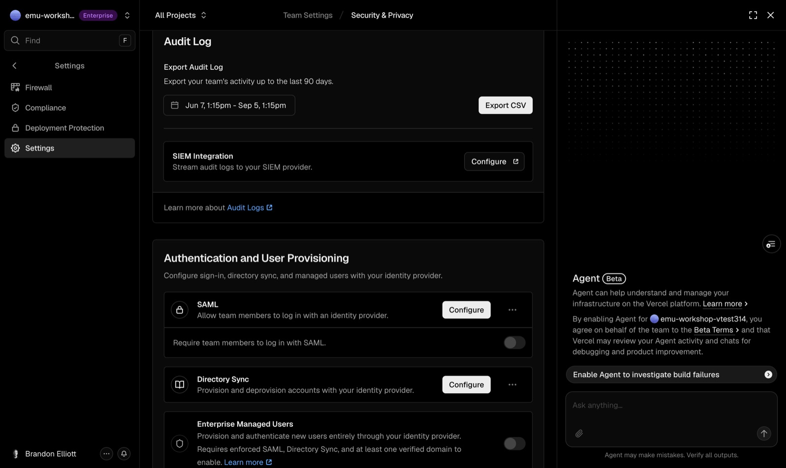

**Pocket ID:** deploy the template first (`./deploy.sh --scope <team> --project idp-ws-<event>`), choose *A Vercel Enterprise team* at `/setup`, enter the domain you will verify and your Vercel login email, and open the console's **Vercel team** panel. It shows every value used below with copy buttons, in the same order.

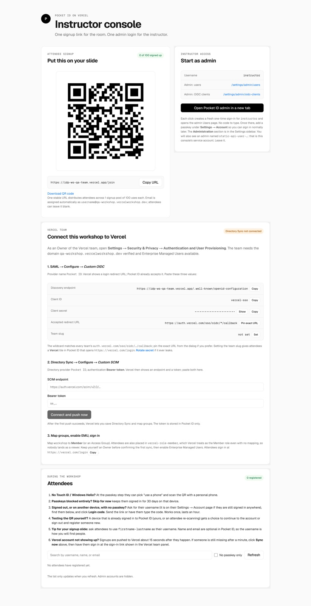

## Step 1: SAML → Configure → Custom OIDC, then enforce

Click **Configure** on the SAML row. A hosted setup portal opens with a provider picker (named providers plus Custom SAML and Custom OIDC). If a previous attempt left a draft, the portal asks before resetting it; resetting is fine.

1. **Identity provider name.** Anything, for example `Pocket ID`.
2. **Create an application.** The portal shows the **login redirect URI** your IdP must accept. It is per team: `https://auth.vercel.com/sso/oidc/<id>/callback`. **Pocket ID:** the client already accepts `https://auth.vercel.com/sso/oidc/*/callback`, so there is nothing to paste back.

   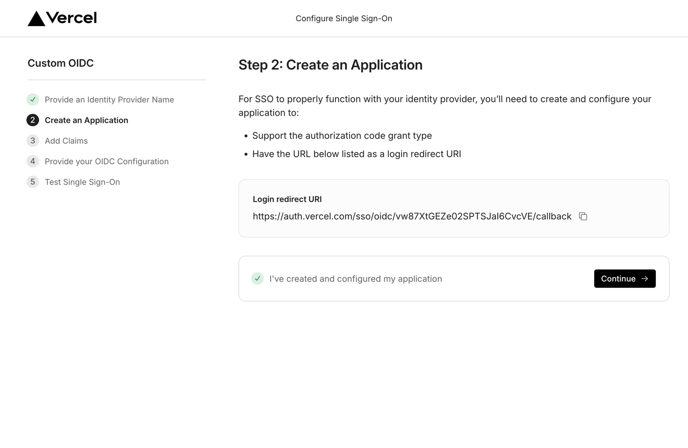

3. **Add claims.** Vercel lists `sub`, `email`, `given_name`, `family_name` as required and `session_lifetime` as optional. An empty `family_name` was accepted in practice.
4. **Provide your OIDC configuration.** Discovery endpoint, Client ID, Client secret. Leave Advanced settings at defaults: *Client secret basic*, *RS256*, *Require PKCE* on, userinfo off.

   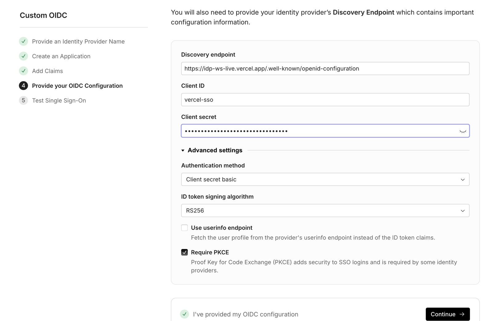

5. **Test Single Sign-On.** The portal sends you through your IdP. Sign in as the account that should stay Owner. **Pocket ID:** click *Open Pocket ID admin* in the console first so the browser is signed in as `instructor`, then run the test.

   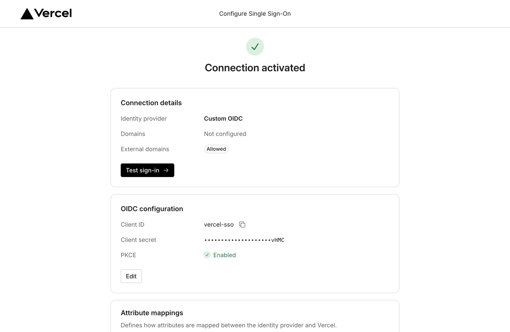

Back on Security & Privacy the row reads *Generic OIDC* and the enforce toggle is replaced by "Authenticate with SAML before enforcing it for this team. [Re-Authenticate]". Click **Re-Authenticate** (you go through the IdP and land back in about a second), then turn on **Require team members to log in with SAML**. There is no confirmation dialog.

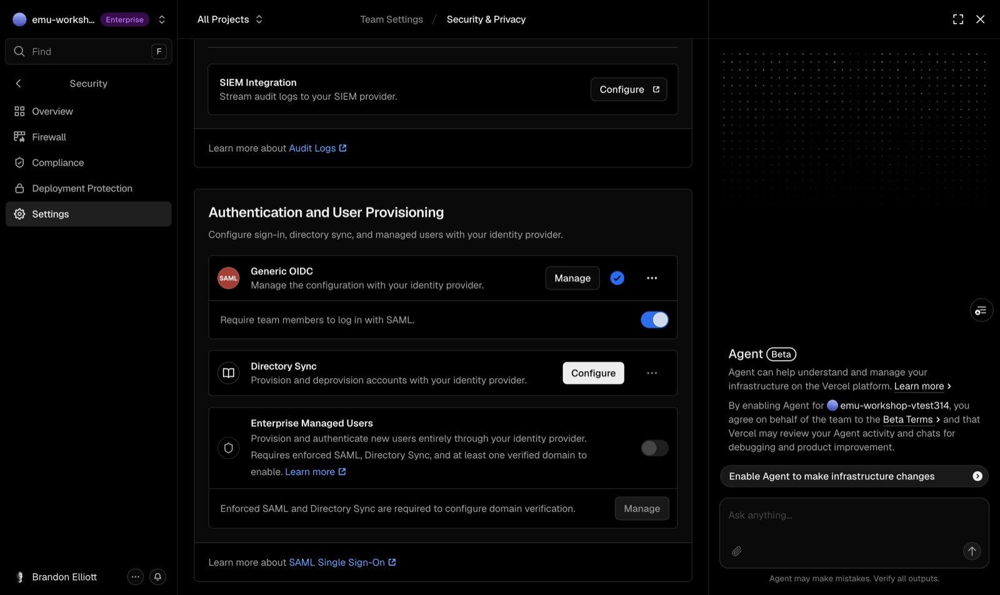

> **Enforcement immediately invalidates every personal access token for this team** ("You must re-authenticate to this scope"). Nothing warns you. Finish CLI work first, or create automation tokens from a SAML-authenticated session afterwards. If you ever need to turn enforcement off, you must be SAML-authenticated to do it, so do it *before* decommissioning the IdP.

## Step 2: Directory Sync → Configure → Custom SCIM, with no mappings yet

Click **Configure** on Directory Sync and pick **Custom SCIM** (or your named provider). Keep *Bearer token* authentication. The portal shows the **SCIM endpoint** (`https://auth.vercel.com/scim/v2.0/<id>`) and a **bearer token** (`se_…`), shown once.

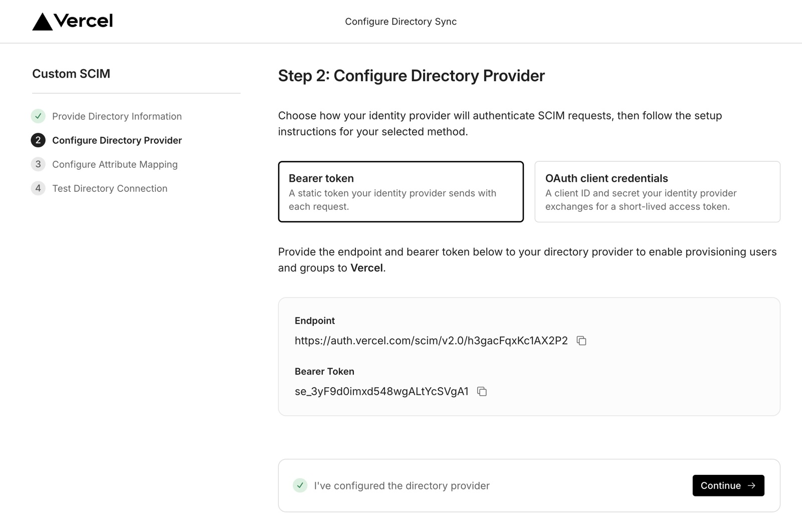

Configure provisioning in your IdP with both values and trigger a first push; the portal waits for it and then offers *Start sync*. **Pocket ID:** paste both into step 2 of the console and click **Connect and push now**; the first push lands in a couple of seconds, and every later signup is pushed automatically.

When Vercel offers role mapping, it also shows this dialog. Choose **Set Up Enterprise Managed Users First**.

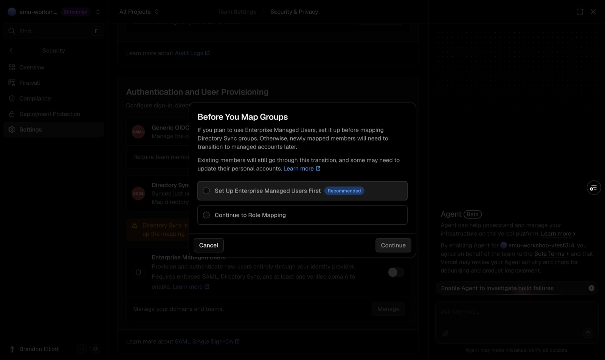

Vercel already sees the directory contents at this point. Group names arrive as whatever your IdP sends as `displayName`; groups named `vercel-role-<role>` get predefined roles (see step 4). **Pocket ID:** the template names its groups `workshop`, `vercel-role-member`, and `vercel-role-owner` in both the technical and display fields for exactly this reason.

## Step 3: Enable EMU and verify the domain

Turn on the **Enterprise Managed Users** toggle (or arrive here from the dialog above). The **Manage Domains** sheet opens; with no verified domains it is empty. Click *Configure Domain*.

> *Configure Domain* navigates the current tab to a hosted verification page, and the "Domain verified" page has no way back. Open it in a new tab, or expect to navigate back to Security & Privacy and toggle EMU again afterwards.

The page gives you a TXT record. For a subdomain the host is the subdomain itself.

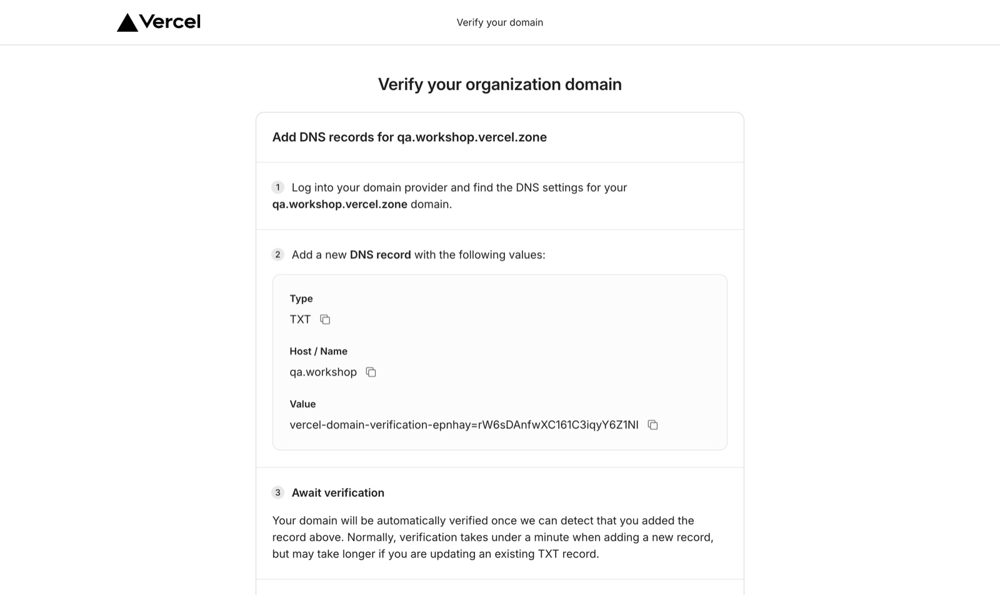

Add the record at your DNS provider. If the zone is on Vercel DNS:

```bash
vercel dns add example.com workshop TXT "vercel-domain-verification-xxxxx=..." --scope <team-that-owns-the-zone>
dig +short TXT workshop.example.com
```

Verification is automatic; it took about 25 seconds after the record resolved.

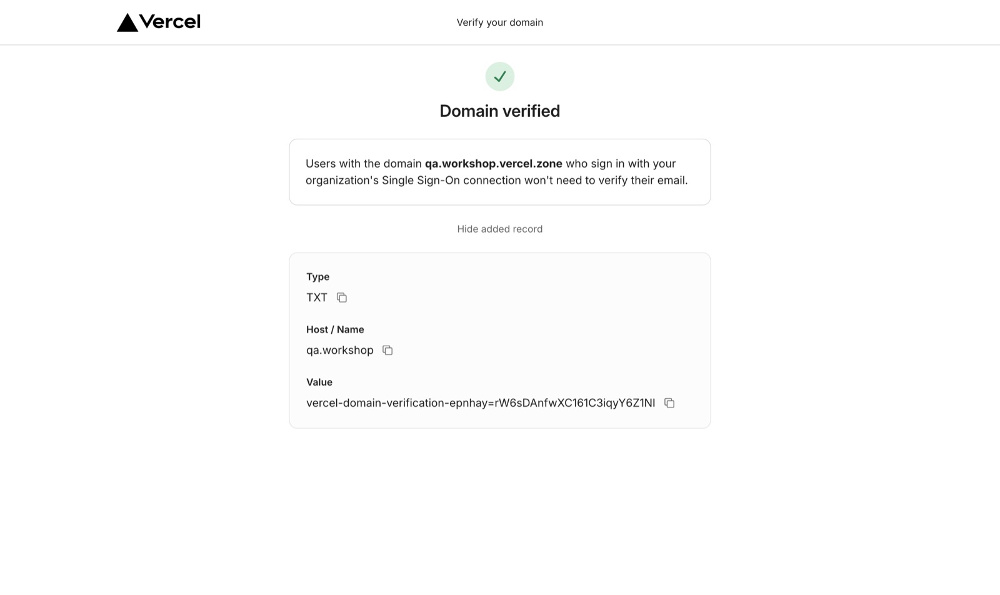

Back on Security & Privacy, toggle EMU again, select the domain, and continue to **Select Teams**.

> **Select Teams lists every eligible team you own, not just the current one.** One stray click makes another team Enterprise Managed. Check only the team you mean.

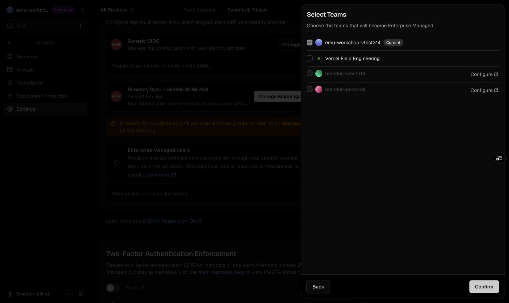

Confirm. From now on anyone your IdP asserts with an email on the verified domain gets a managed account, and nobody can create a personal Vercel account on that domain.

## Step 4: Map groups to roles

Now click **Manage Mappings**. Unmapped groups default to Viewer. Groups named `vercel-role-<role>` are pre-mapped and locked ("This group has a predefined role which cannot be modified"), so an instructor who skips this step still gets Members and an Owner.

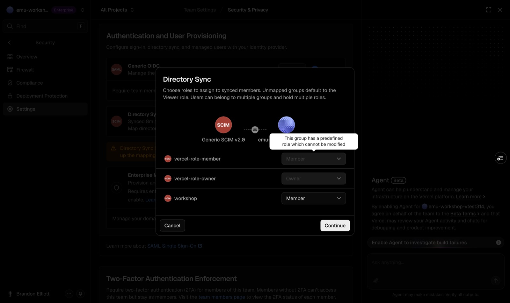

**Pocket ID:** map `workshop` to **Member** (or an Access Group). After confirming, the directory moves from `SETUP` to `ACTIVE`, and your own membership shows `joinedFrom.origin: saml`: you are now a directory-managed Owner.

## What the user sees

Someone your IdP knows should reach the team with no account creation. **Pocket ID:** attendees sign up with a passkey and get a **Vercel** tile that opens `vercel.com/login?saml=<team-slug>`.

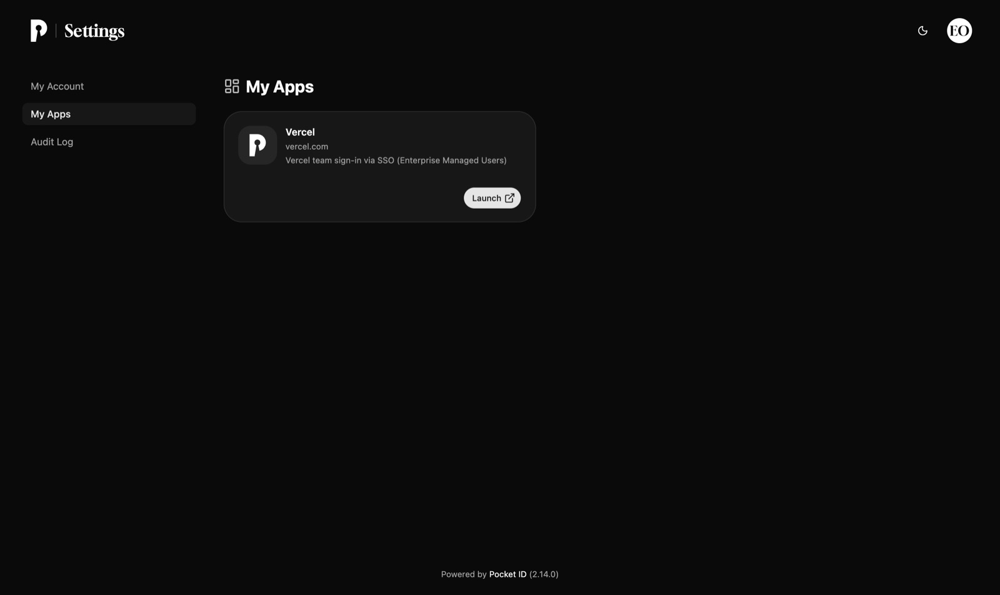

Provisioning timing on the verified run: the template pushed the user 14 seconds after signup, and Vercel had created the directory membership about a minute later. Expect roughly 75 seconds from signup to "Vercel knows this person".

### For comparison: the same sign-in without EMU

With SSO and Directory Sync but EMU off, the user gets through the IdP and is then asked to create or link a personal Vercel account. This is the screen EMU removes.

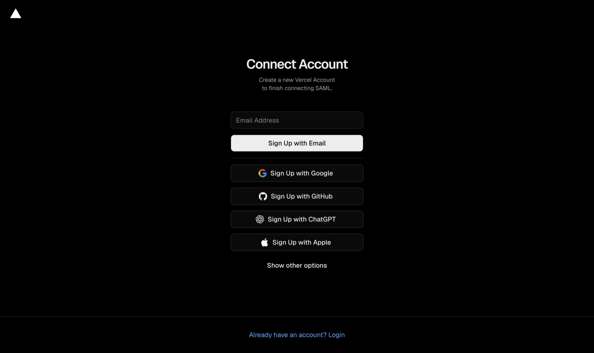

## Verifying from the API

Once SAML is enforced your personal token no longer works against the team; run these from a SAML-authenticated session, or before enforcing.

```bash
# Connection, enforcement, directory state, role mappings
curl -s -H "Authorization: Bearer $TOKEN" "https://api.vercel.com/v2/teams/$TEAM" \
  | python3 -c "import sys,json;print(json.dumps(json.load(sys.stdin).get('saml'),indent=1))"

# Members (confirmed) and directory-created invitations (pending)
curl -s -H "Authorization: Bearer $TOKEN" "https://api.vercel.com/v2/teams/$TEAM/members"
curl -s -H "Authorization: Bearer $TOKEN" "https://api.vercel.com/v3/teams/$TEAM/members"
```

The dashboard's Members → Pending Invitations tab does not list directory-created invitations; the API does. **Pocket ID:** the console's `GET /api/workshop/vercel` shows the last push time and any push error, but cannot see whether Vercel accepted a user into the team.

## Unwinding safely

1. While the IdP still exists and you are SAML-authenticated, turn **enforcement off**. Skipping this and deleting the IdP locks everyone out of the team.
2. Remove Directory Sync, then SAML, from Security & Privacy. Managed users removed from every EMU team are eventually deleted by Vercel.
3. Delete the verification TXT record and remove the domain from the team.
4. **Pocket ID:** `./teardown.sh <project> --scope <team> --yes` removes the template and its database. Do this last.

## Troubleshooting

| Symptom | Cause / fix |
|---|---|
| Re-Authenticate fails or signs you in as someone else | The email your IdP asserts must equal the Owner's Vercel login email. **Pocket ID:** set *Your account as Owner* in the console to your Vercel email and repeat. |
| `vercel` CLI or API returns 403 for the team after enforcing | Expected. Personal tokens are invalidated by enforcement; re-authenticate via SAML or create a token from a SAML session. |
| User reaches Vercel but is asked to "Connect Account" or sign up | EMU is not enabled, or the user's email is not on a verified domain. |
| User's first SSO sign-in ends on `failed_to_provision_enterprise_user` | Observed on 2026-09-05 with a correctly configured team: Vercel created the managed account but did not join it to the team. Contact Vercel support with the team id, the user's email, and the timestamp. Do not let users take the personal-login buttons on that page. |
| Attendee provisioned as Viewer | Role mapping missing. `vercel-role-member` covers this by default; map other groups explicitly. |
| Invitation missing from Members → Pending Invitations | Directory-created invitations only appear in the API today. |
| Provider picker shows "Continue setup" drafts | Stale drafts from earlier attempts; choosing your provider resets them. |

## Entra ID cheat sheet

Same Vercel steps, different left-hand side. Items marked † come from Microsoft's documentation rather than this run; confirm them on the tenant.

| Vercel asks for | Where it lives in Entra ID |
|---|---|
| Provider in the SSO picker | *Microsoft Entra* (guided), or the generic OIDC path above with an App registration. |
| Login redirect URI | App registration → Authentication → Web → Redirect URIs: the `https://auth.vercel.com/sso/oidc/<id>/callback` value from the portal.† |
| Discovery endpoint | `https://login.microsoftonline.com/<tenant-id>/v2.0/.well-known/openid-configuration`† |
| Client ID / secret | Overview → Application (client) ID; Certificates & secrets → New client secret (note the expiry).† |
| Claims `email`, `given_name`, `family_name` | Token configuration → Add optional claim → ID token. `email` is only emitted when the user has a mail attribute.† |
| SCIM endpoint and bearer token | Enterprise application → Provisioning → Automatic → Tenant URL / Secret Token. Entra commonly needs `?aadOptscim062020` appended to the tenant URL for SCIM compliance; test the connection first.† |
| Groups → roles | Assign groups under Users and groups; the group `displayName` is what Vercel maps. Naming groups `vercel-role-member` / `vercel-role-owner` gives locked default mappings. |
| Provisioning speed | Entra's automatic cycle runs about every 40 minutes; use *Provision on demand* for the first users.† |
| Verified domain | The organisation's email domain, verified with the TXT record from step 3. Every member must be on a verified domain once EMU is on. |
| Your own Owner account | Your Entra user must be in the Owner-mapped group before the first sync, with an `email` claim equal to your Vercel login email. |

Existing personal Vercel accounts on the organisation's domain are handled by Vercel's Hobby team transition; read the [EMU documentation](https://vercel.com/docs/security/enterprise-managed-users) before committing to a rollout date.
