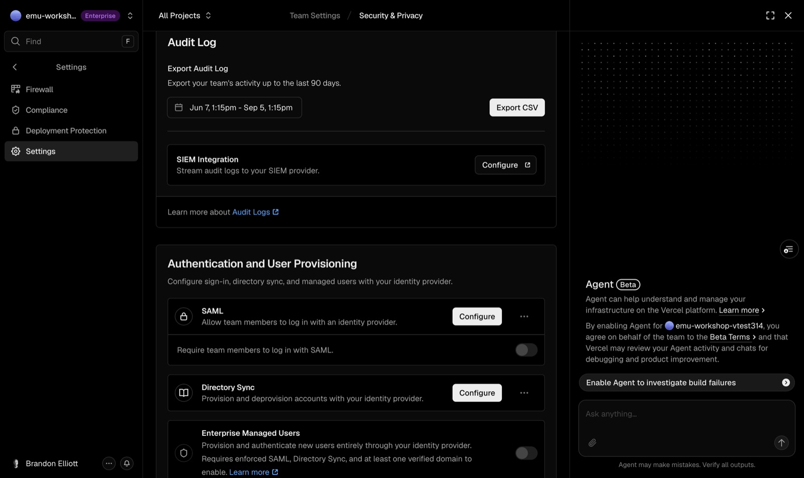
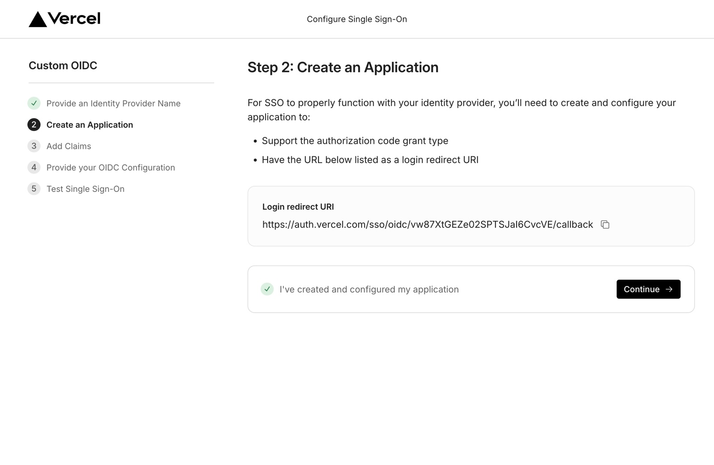
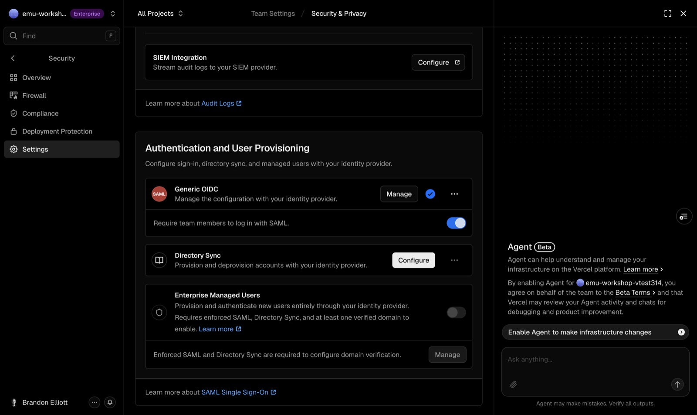
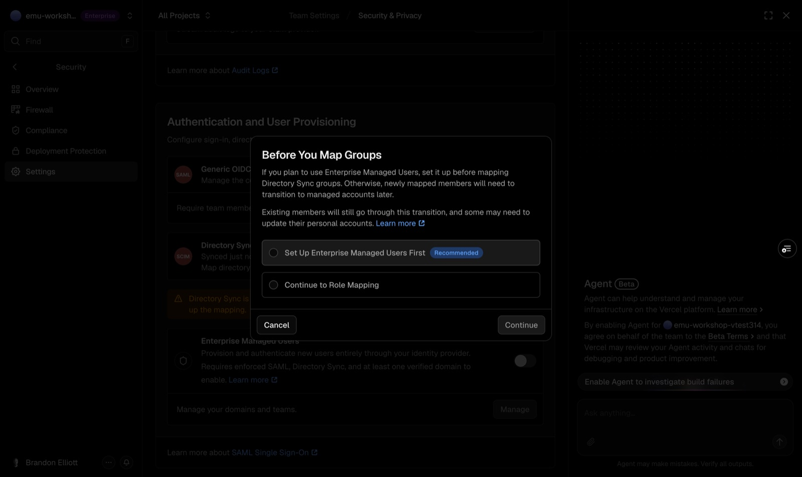
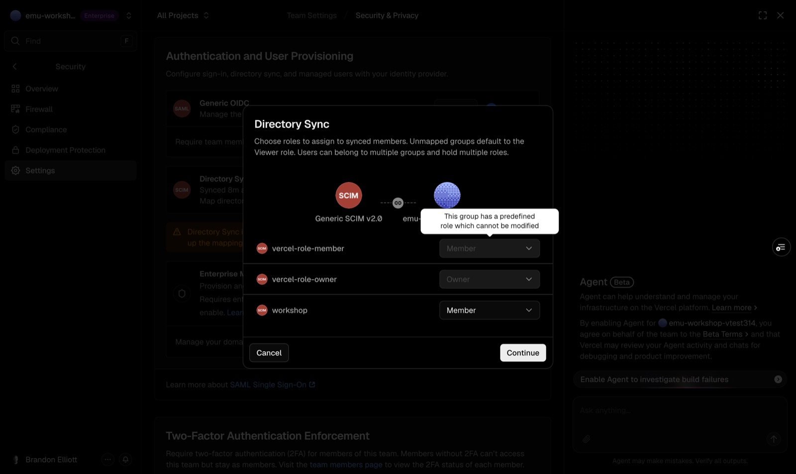
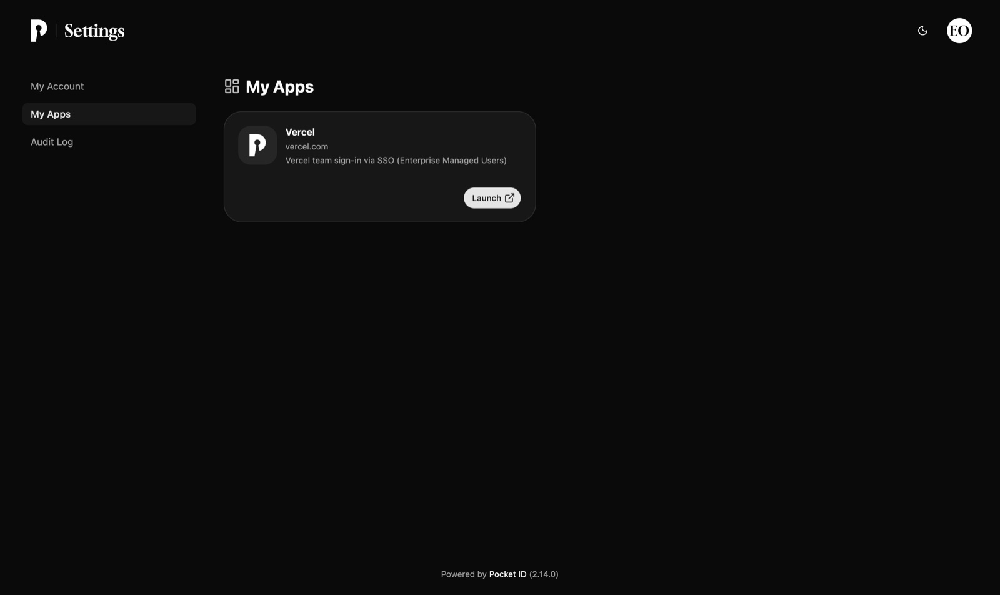
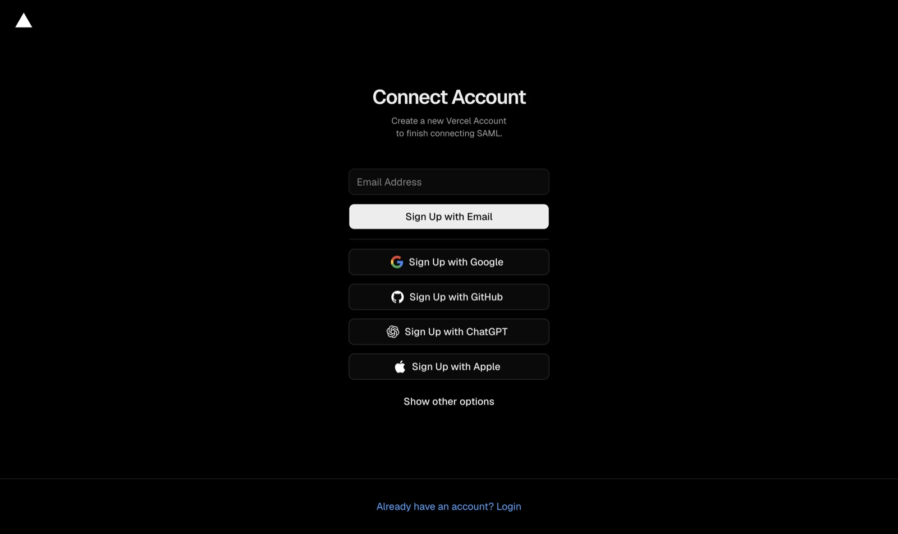

# Pocket ID on Vercel — workshop setup guide

**For SAs and workshop instructors.** This project runs a disposable Pocket ID identity provider on Vercel. It is not a customer’s production identity-provider integration. Choose **App mode** for login to a workshop app, or **Vercel team mode** for managed attendee accounts on an Enterprise team. This guide covers team mode; see the [README](../README.md) for app mode and deployment options.[11]

## What this guide proves

The September 5 rehearsal exercised Custom OIDC sign-in, SSO enforcement, Custom SCIM push, domain verification, EMU configuration and role mapping. It **did not establish a successful attendee landing on an unrestricted Enterprise team**: the rehearsal team rejected the attendee at the team-join step. Treat the screenshots as historical setup examples—not an end-to-end success certificate. Run the attendee check below before an event.

Screenshots use an old disposable environment. Never copy its team, domain or callback identifiers. Credential-bearing configuration screens and internal Admin pages are deliberately omitted.

## 1. Prepare the workshop

- Use an authorized, disposable **Enterprise participant team** that permits the intended attendees, with a Vercel Owner available. Do not reuse a production team merely to rehearse EMU.
- Choose a domain you control: an existing domain or one purchased through Vercel both work. A dedicated event subdomain makes cleanup easier. Verify it with the TXT record; no website or mailbox is needed. Review the Owner identity, domain coverage and existing-account implications before enabling managed accounts.[3]
- Deploy the template using the README’s Deploy Button or `./deploy.sh --scope <hosting-team> --project idp-ws-<event>`. The hosting team and participant team can be different.[11]
- Open the short production hostname immediately; the first visitor claims `/setup`. Choose **A Vercel Enterprise team**, enter the workshop domain, Owner’s Vercel login email and headcount. Save the instructor password, wait for preparation, then open `/workshop`.[11]
- Keep the IdP’s production hostname public and stable: it serves OIDC endpoints and is the passkey relying-party hostname. Do not put it behind the login that attendees are trying to establish.[11]

Open participant **Team Settings → Security & Privacy → Authentication and User Provisioning**.[1][2]

## 2. Connect Pocket ID with Custom OIDC

The Vercel row is labeled **SAML**, but this project uses the **Custom OIDC** provider—not a SAML application.[11]

1. Select **SAML → Configure → Custom OIDC**; provider name **Pocket ID**.
2. Use the current login redirect URI from the setup portal. The template’s `vercel-sso` client accepts Vercel’s OIDC callback pattern; check the displayed URI rather than copying the screenshot.
3. Copy the **Discovery endpoint**, **Client ID** and **Client secret** from the instructor console’s **Vercel team** panel into the portal. Do not put secrets in slides or documentation.
4. Use **Open Pocket ID admin** to sign in as `instructor`, then run the portal’s sign-in test. The asserted email must match the Owner’s Vercel login for that Owner test.
5. Return to Security & Privacy, **Re-Authenticate**, verify Owner access, then enable **Require team members to log in with SAML**.[11]

**Plan the enforcement change.** The rehearsal observed existing personal-token requests to the team becoming unauthorized. Finish CLI work first and verify the automation-authentication path you will use afterward. Vercel requires the enforcing Owner to already be SSO-authenticated.[1]

## 3. Connect Custom SCIM — do not map roles yet

Select **Directory Sync → Configure → Custom SCIM**, use provider name **Pocket ID** and bearer-token authentication. Paste Vercel’s newly generated endpoint and token into the console, then **Connect and push now**. Complete the portal’s connection test.[11]

When prompted about mappings, select **Set Up Enterprise Managed Users First**. Current EMU documentation requires role mappings **after** EMU; premature mappings create invitations that can stop working when EMU is enabled.[3]

## 4. Enable EMU, then map the groups

1. Turn on **Enterprise Managed Users** to open **Manage Domains**. Verify the approved workshop email domain using the TXT record generated for this setup.
2. Select only the intended domain and participant team; confirm EMU. Review the team list carefully—it can include other eligible teams you own.
3. Open **Manage Mappings**. Preserve `vercel-role-owner → Owner`; review `vercel-role-member → Member`; map `workshop → Member` or the intended Access Group. Check the resulting member preview before confirming.[3][11]

Directory Sync overwrites existing roles, including the operator’s. The template’s Owner group is a safeguard, not a substitute for checking the actual identity and mapping.[2]

## 5. Prove the attendee experience

Set the participant team slug in the instructor console. In a separate browser session, use `/join`, register a throwaway attendee and create a passkey. Allow provisioning to complete, then use the **Vercel** tile.[11]

**Pass criteria:** attendee reaches the correct Vercel team as a managed Member without personal-account creation; the Owner still has access. Check v0 separately if the workshop needs it. SCIM push success alone is not proof of a completed team join.

If the user sees **Connect Account**, check EMU, the asserted email/domain and pre-EMU invitations. If a generic provisioning error appears, capture the team, user and timestamp privately and check restrictions—do not bypass the intended policy.[3][11]

## During the workshop and cleanup

The instructor console is this template's `/workshop` page. Use it to copy the short `/join` URL for attendees to open on their workshop laptops, look up attendees, and issue one-time login codes. QR is optional. Pocket ID admin is the separate upstream UI for users and clients.[11]

Room size controls signup tokens, not pre-created accounts or Vercel billing seats. 100 attendees creates 2 tokens; 1,000 creates 12, adding ten serial API calls and about ten seconds of configured pauses. Accounts are created at signup. Flex does not require preset seat quantities; check the participant team's actual plan and entitlements. EMU enrollment is generally available. For app protection rather than Vercel account provisioning, use [Passport mode](../README.md#passport-mode-protecting-deployed-apps).[11]

After the event, while the IdP still works: turn SSO enforcement off → remove Directory Sync and SSO → remove the workshop domain association/TXT record as appropriate → run `./teardown.sh <project> --scope <hosting-team> --yes` to remove the IdP project and database. Retire the participant trial/team using its approved process. Never delete the IdP first and strand an enforced team.[11]

## References

Project behavior: [README and deployment options](../README.md). Platform requirements: current Vercel SSO, Directory Sync and EMU documentation below. Screenshots document the September 5 rehearsal only.

## Sources

[1] https://vercel.com/docs/saml — Team SAML SSO
[2] https://vercel.com/docs/directory-sync — Directory Sync
[3] https://vercel.com/docs/security/enterprise-managed-users — Enterprise Managed Users
[11] https://github.com/Brandon168/pocket-id-vercel — Pocket ID on Vercel project
